# Pokémon TCG E-Commerce — Frontend

[](https://frontend-pokemon-tcg-ecommerce.vercel.app/)


Full-featured e-commerce storefront for Pokémon TCG products. Built with Next.js 15 App Router, TypeScript, Tailwind CSS, and integrated with a real Stripe payment flow. Includes both a customer-facing shopping experience and a full admin dashboard.

> **Test account** — email: `test@email.com` · password: `password`  
> **Test card** — `4242 4242 4242 4242` · expiry: `12/29` · CVC: `424`

---

## Screenshots

### Main Pages

| Home                                   | Products                                       | Product Detail                                     | Cart                                   | Thank You                                             |
| -------------------------------------- | ---------------------------------------------- | -------------------------------------------------- | -------------------------------------- | ----------------------------------------------------- |
| 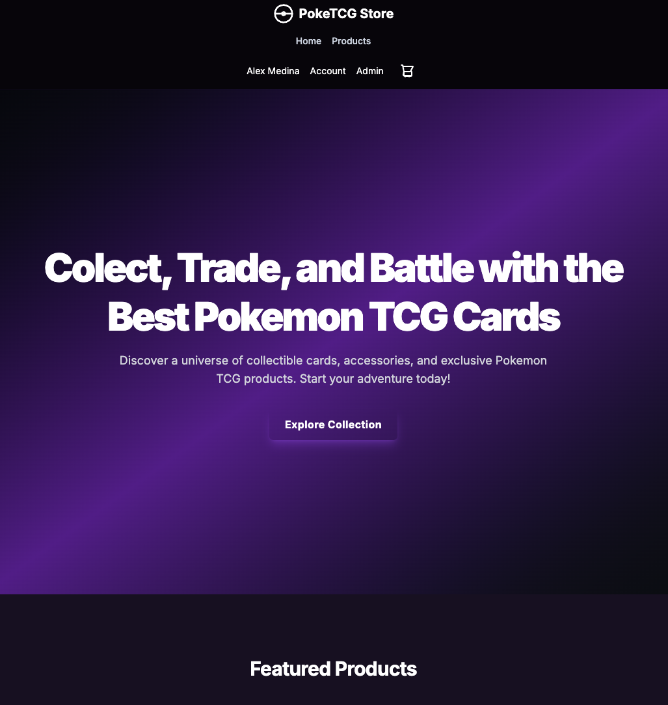 | 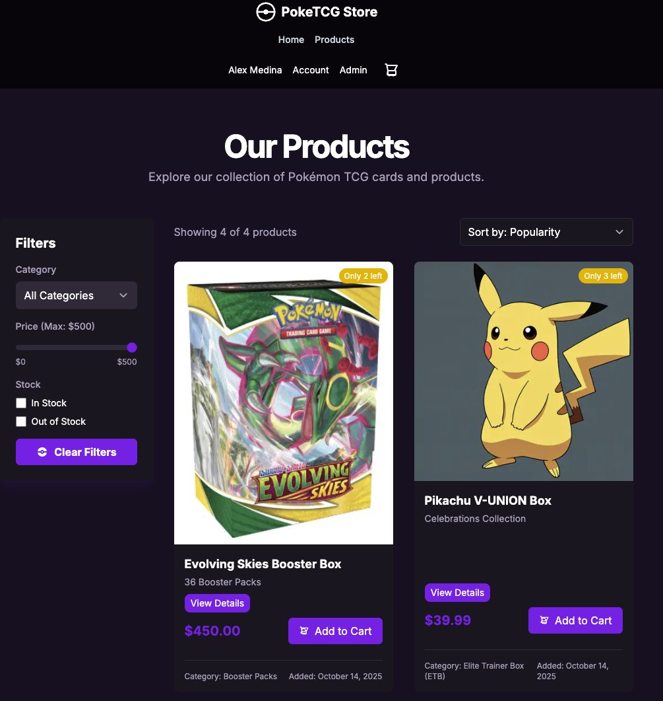 | 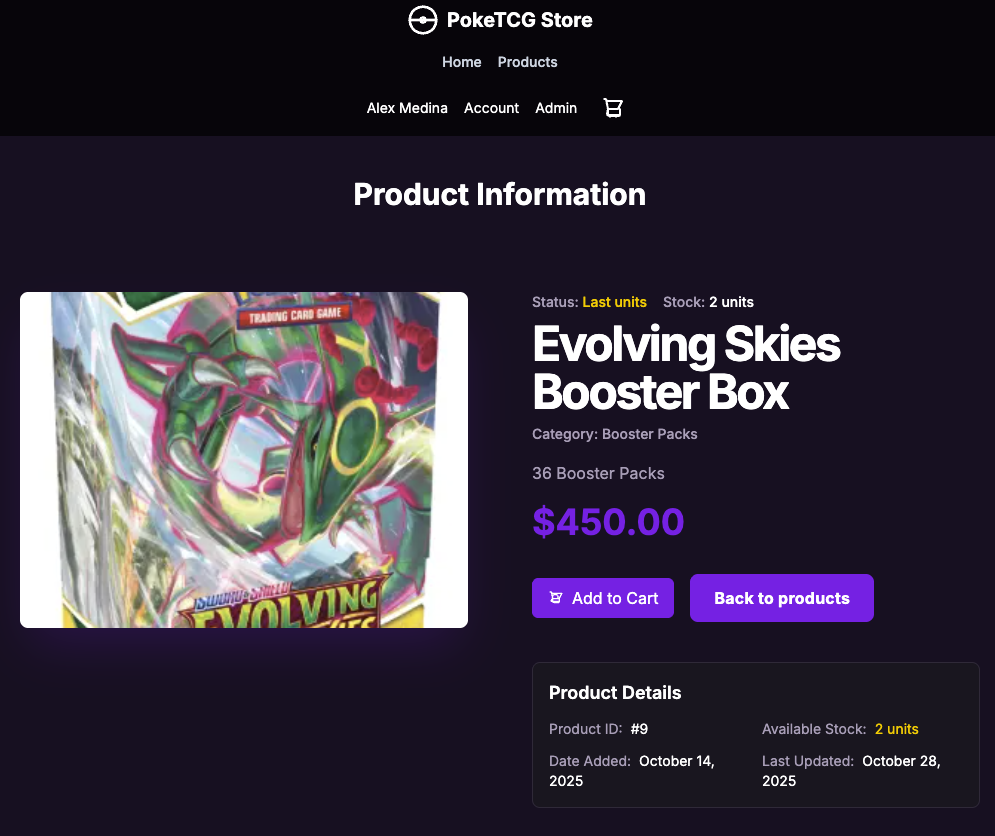 | 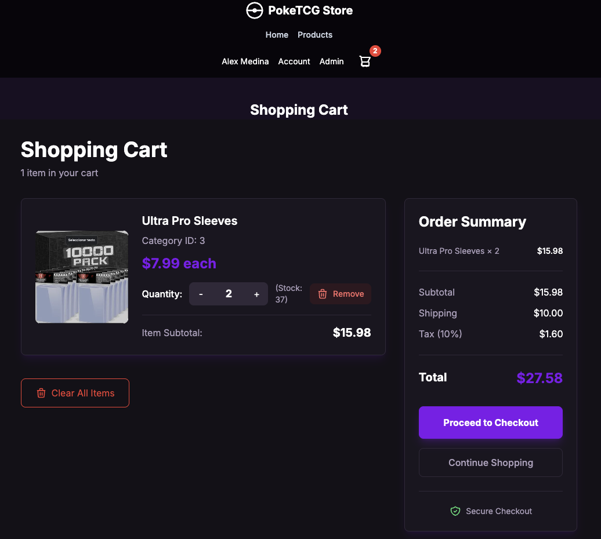 | 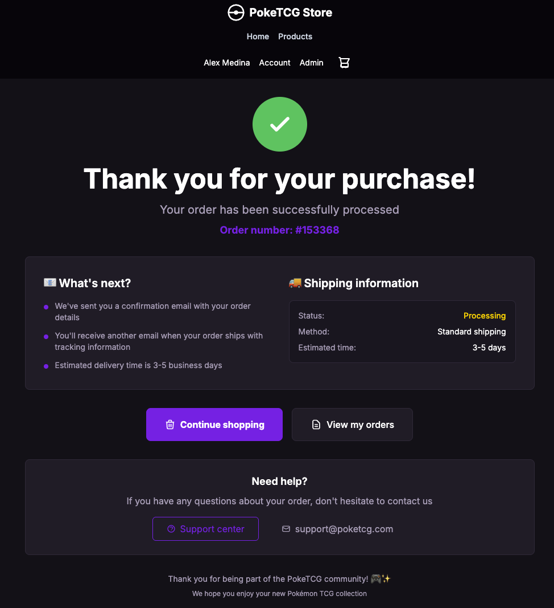 |

### Authentication

| Login                                    | Create Account                                       |
| ---------------------------------------- | ---------------------------------------------------- |
| 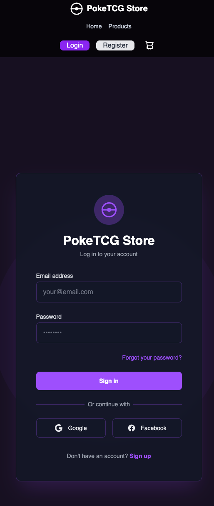 | 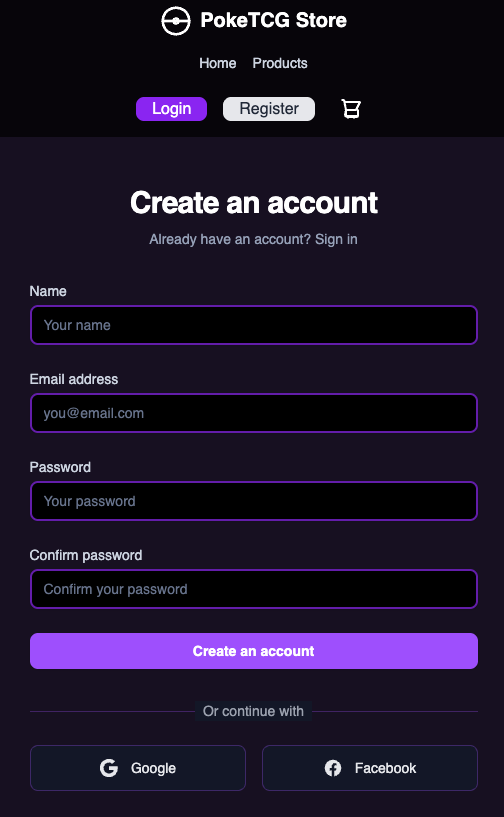 |

### Account & Admin

| User Account                                      | Admin Dashboard                                  | Admin Orders                                     | Admin Products                                       |
| ------------------------------------------------- | ------------------------------------------------ | ------------------------------------------------ | ---------------------------------------------------- |
| 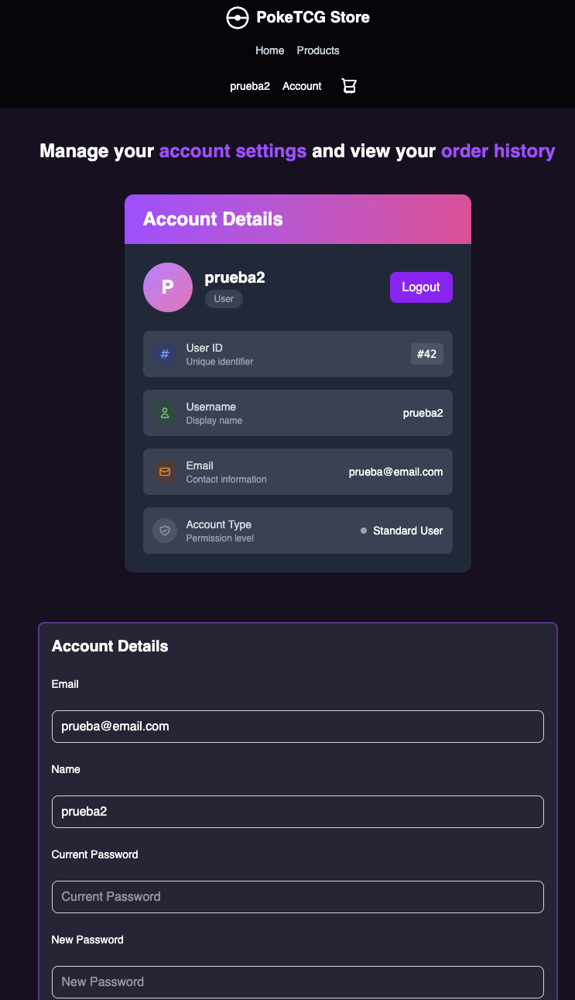 | 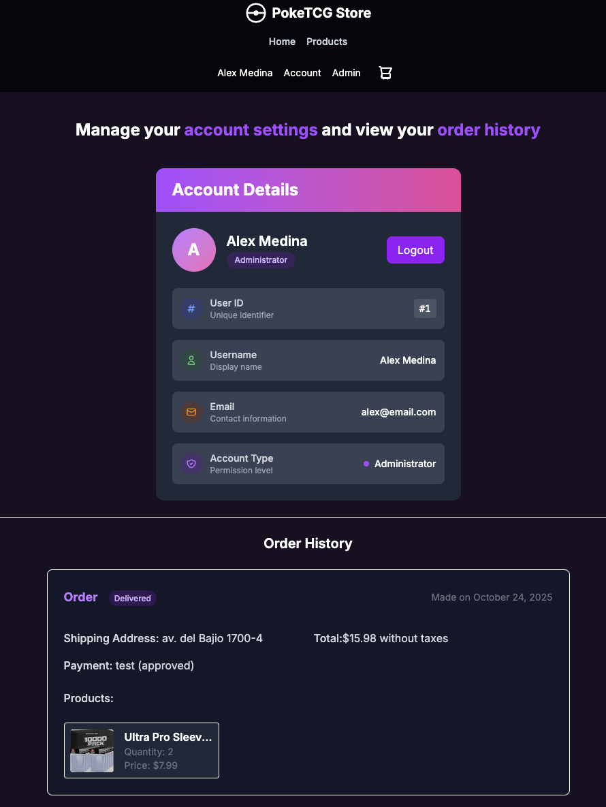 | 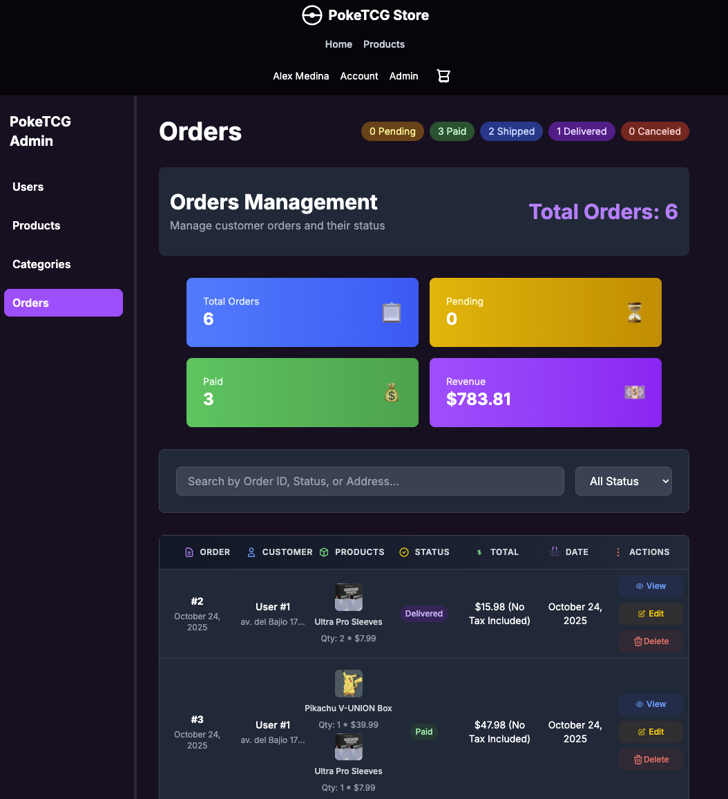 | 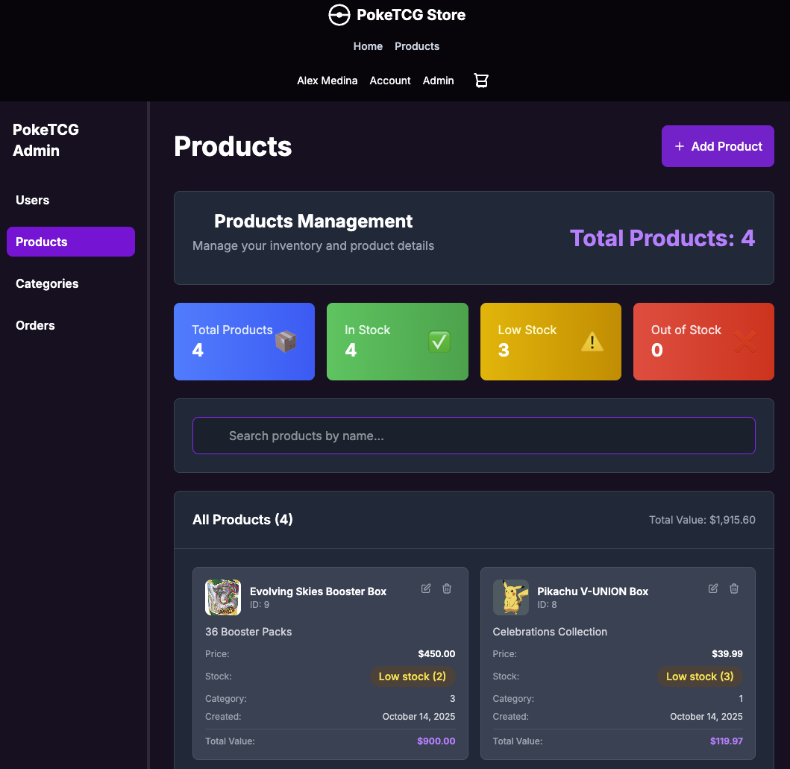 |

---

## Key Features

### Shopping Experience

- Responsive product grid with search and category filtering
- Product detail pages with full info and add-to-cart
- Persistent cart state across sessions (Zustand + localStorage)
- Real-time stock validation — prevents adding more than available stock

### Stripe Checkout (2-step flow)

- **Step 1 — Shipping**: collect and validate address, compute subtotal + shipping + tax
- **Step 2 — Payment**: Stripe `<PaymentElement>` renders inside a secure iframe; `stripe.confirmPayment()` runs client-side; backend confirmation call verifies amount integrity and decrements stock in a DB transaction
- Order confirmed → cart cleared → redirect to thank-you page

### Authentication & Authorization

- Cookie-based JWT authentication with server-side validation via Next.js server actions
- Protected routes — unauthenticated users redirected to login
- Role-based UI — admin dashboard only visible to admin accounts

### Admin Dashboard

- Full CRUD for products, categories, users, and orders
- Order status management (pending → paid → shipped → delivered)
- Inline forms validated with Zod schemas

### Performance & Quality

- **99/100** Vercel Speed Insights score
- Turbopack-powered builds for fast HMR
- Image optimization via Next.js `<Image>` + Cloudinary CDN
- Full TypeScript — all API responses validated with Zod schemas at runtime

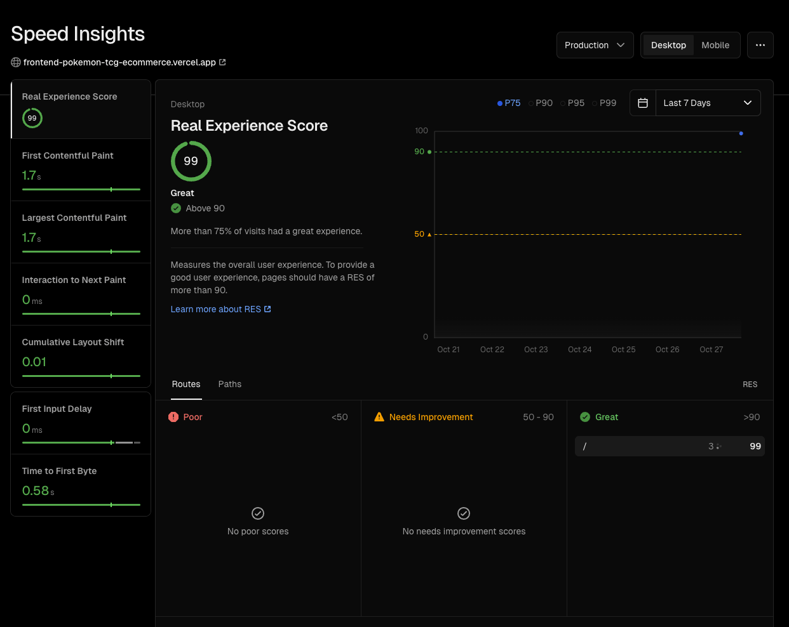

---

## Tech Stack

| Category          | Technology                               |
| ----------------- | ---------------------------------------- |
| Framework         | Next.js 15 (App Router, Server Actions)  |
| Language          | TypeScript 5                             |
| Styling           | Tailwind CSS 4                           |
| Payments          | Stripe.js + @stripe/react-stripe-js      |
| State management  | Zustand 5 (persisted cart)               |
| Schema validation | Zod 4                                    |
| HTTP              | Native `fetch` with typed server actions |
| Images            | Cloudinary CDN via Next.js Image         |
| Dev tooling       | Turbopack, pnpm, ESLint                  |

---

## Project Structure

```
frontend/
├── app/
│   ├── page.tsx                  # Landing / root redirect
│   ├── home/                     # Home page
│   ├── products/                 # Product listing + [slug] detail
│   ├── cart/
│   │   ├── page.tsx              # Cart review
│   │   └── checkout/
│   │       ├── page.tsx          # 2-step checkout (shipping → Stripe)
│   │       └── thank-you/       # Post-payment confirmation
│   ├── auth/                     # Login, register, account
│   └── admin/                    # Admin dashboard (users/products/orders/categories)
├── actions/                      # Next.js Server Actions (typed, Zod-validated)
│   ├── checkout-payment-action.ts   # POST /payments/create-intent
│   ├── confirm-payment-action.ts    # POST /payments/confirm
│   └── ...                          # CRUD actions for admin
├── components/
│   ├── cart/
│   │   ├── StripeCheckoutForm.tsx   # Stripe Elements wrapper + PaymentElement
│   │   ├── OrderSummary.tsx
│   │   └── ...
│   ├── auth/
│   ├── admin/
│   └── ui/
├── store/
│   └── cartStore.ts              # Zustand store with persist middleware
├── src/
│   └── schemas.ts                # All Zod schemas + inferred TypeScript types
└── utils/
    ├── api.ts                    # authenticatedFetch helper
    └── index.ts                  # formatCurrency, etc.
```

---

## Getting Started

```bash
# Clone the repository
git clone https://github.com/Meva1997/frontend-pokemonTCG-ecommerce.git
cd frontend-pokemonTCG-ecommerce

# Install dependencies
pnpm install

# Configure environment variables
# Create a .env file with:
# API_URL=http://localhost:4000/api
# NEXT_PUBLIC_API_URL=http://localhost:4000/api
# NEXT_PUBLIC_STRIPE_PUBLISHABLE_KEY=pk_test_...

# Start the development server
pnpm dev

# Build for production
pnpm build && pnpm start
```

---

## Environment Variables

```env
API_URL=http://localhost:4000/api                     # Used by server actions
NEXT_PUBLIC_API_URL=http://localhost:4000/api         # Used by client components
NEXT_PUBLIC_STRIPE_PUBLISHABLE_KEY=pk_test_...        # Stripe publishable key
```

---

## Architecture Decisions

- **Server Actions over API Routes** — mutations go through typed server actions, keeping secrets server-side and avoiding an extra round-trip
- **Zod at the boundary** — every API response is parsed through a Zod schema before being used in the UI, catching backend contract changes at runtime
- **Stripe client-side confirmation** — `stripe.confirmPayment()` runs in the browser (no card data ever touches our server); the backend only receives the `paymentIntentId` to verify and fulfill
- **Optimistic UX** — cart updates are instant (Zustand), server sync happens in the background

---

## License

MIT — see [LICENSE](./LICENSE) for details.
