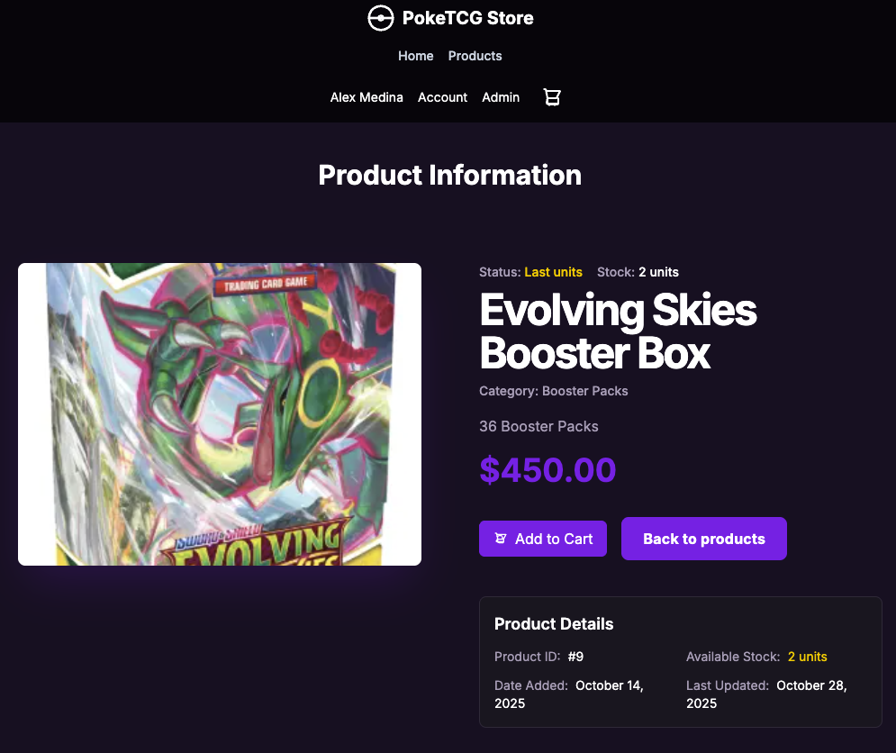

# Pokémon TCG E‑Commerce Frontend

[](https://frontend-pokemon-tcg-ecommerce.vercel.app/)

A modern, modular e-commerce frontend for Pokémon Trading Card Game products. Built with Next.js, TypeScript, and Tailwind CSS, this project delivers a fast, accessible, and scalable shopping experience for collectors and fans.

Test email: test@email.com  
Test password: password

---

## Screenshots

### Main Pages

| Home Page                              | Products                                       | Product Detail                                      | Cart & Checkout                        | Thank You                                             |
| -------------------------------------- | ---------------------------------------------- | --------------------------------------------------- | -------------------------------------- | ----------------------------------------------------- |
|  |  |  |  |  |

### Authentication

| Login                                    | Create Account                                             |
| ---------------------------------------- | ---------------------------------------------------------- |
|  |  |

### Account

| User Account                                           | Admin Account                                            |
| ------------------------------------------------------ | -------------------------------------------------------- |
|  |  |

### Admin Dashboard

| Users                                                | Products                                                   | Orders                                                 | Categories                                                     |
| ---------------------------------------------------- | ---------------------------------------------------------- | ------------------------------------------------------ | -------------------------------------------------------------- |
|  |  |  |  |

### Design Inspiration

| StitchAI Design                                |
| ---------------------------------------------- |
|  |

---

## Features

- Browse Pokémon TCG products with responsive grid layouts
- Product detail pages with images, price, and description
- Add/remove products to cart, with persistent cart state
- Checkout flow with order summary and payment simulation
- User authentication (login, register, protected routes)
- View order history and account settings for authenticated users
- Admin dashboard for managing orders and statuses
- Dark mode support
- Mobile-first, fully responsive design

## Tech Stack

- **Next.js 13+** (App Router)
- **TypeScript**
- **Tailwind CSS**
- Zustand (cart state management)
- Zod (schema validation)
- Cloudinary (product images)
- Custom authentication
- (Planned) Stripe payments

## Project Structure

```
frontend/
  app/
    cart/checkout/         # Checkout and thank-you pages
    auth/                  # Login, register, account pages
    admin/orders/          # Admin order management
    products/              # Product listing and details
  components/
    cart/                  # Cart, OrderSummary, etc.
    auth/                  # AccountForm, OrderHistory, UserNav
    admin/orders/          # OrdersTable, OrderStatusEditor
    shared/                # UI primitives, layout, buttons
  src/
    schemas.ts             # Zod schemas for validation
    store/                 # Zustand store for cart
    utils/                 # Utility functions
    auth/                  # Auth helpers
  public/                  # Static assets
  tailwind.config.js       # Tailwind configuration
  README.md                # Project documentation
```

## Getting Started

```bash
# Clone the repository
git clone https://github.com/Meva1997/frontend-pokemonTCG-ecommerce.git
cd frontend-pokemonTCG-ecommerce

# Install dependencies
pnpm install
# or
yarn install
# or
npm install

# Start the development server
pnpm dev
# or yarn dev / npm run dev

# Build for production
pnpm build
pnpm start
```

## Environment Variables

Create a `.env.local` file for API keys and secrets:

```
POKEMON_TCG_API_KEY=your_key
NEXT_PUBLIC_API_URL=http://localhost:4000/api
```

## Main Pages & Components

- **Home**: Product grid, featured cards
- **Product Detail**: Card info, add to cart
- **Cart**: View, update, and remove items
- **Checkout**: Order summary, payment simulation
- **Auth**: Login, register, account management
- **Order History**: List of past orders for logged-in users
- **Admin**: Orders dashboard, status editing

## Roadmap

- [x] Responsive product grid and detail pages
- [x] Cart state with add/remove/persist
- [x] Checkout flow and order summary
- [x] User authentication and protected routes
- [x] Order history and account settings
- [x] Admin order management
- [x] Dark mode
- [x] Real Pokémon TCG API data
- [ ] Stripe payment integration
- [ ] Basic unit and integration tests

## Design Principles

- **Simplicity**: Clean, maintainable code and UI
- **Performance**: Fast load times, optimized images
- **Accessibility**: Semantic HTML, keyboard navigation
- **Type Safety**: Strong typing for all domain models
- **Mobile First**: Fully responsive layouts

## Performance

This project was tested with Vercel Speed Insights and achieved a score of **99** for performance and best practices.


---

## Contributing

Contributions are welcome! Please open an issue or pull request for suggestions, bug fixes, or new features.

## License

This project is licensed under the MIT License. See the [LICENSE](./LICENSE) file for details.

---

This README will be updated as new features are released and the project evolves.
